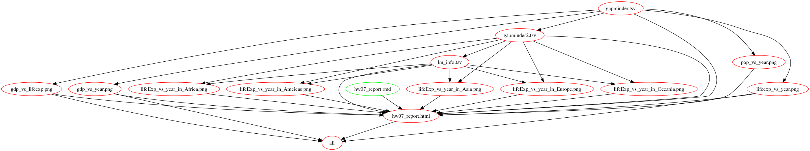

# STAT545-hw07-Tang-Qiaoyue

## Description
In this homework I mainly practised how to use `make` to automate data analysis pipelines. There are 5 main steps in this homework:

- Download gapminder dataset from github
- Clean the original dataset and write a new one for analysis later
- Perform some analysis using the new dataset
- Generate some figures to help visualization
- Create a makefile to automate the analysis

## Links

[Link to the report in RMD](https://github.com/qiaoyuet/STAT545-hw07-Tang-Qiaoyue/blob/master/hw07_report.Rmd)

[Makefile to generate everything](https://github.com/qiaoyuet/STAT545-hw07-Tang-Qiaoyue/blob/master/Makefile)

[Return to main homework directory](https://github.com/qiaoyuet/STAT545-hw-Tang-Qiaoyue)

## Dependency Graph

This graph is made using [makefile2graph](https://github.com/lindenb/makefile2graph)

## Report process
- The difficulties in this homework was mainly to create the makefile. I followed the [examples](http://stat545.com/automation04_make-activity.html) given in the lecture and it helped me a lot when completing this homework. I found makefile very useful since it now only needs one click to generate all the files I need for analysis. And most importantly, if I correctly tell it all the dependencies, it can reporduce itself after I make changes in the scripts. It's a very neat way to keep track of the scripts and changes. Some code in the analysis part of this assignment is recycled from my previous homeworks. 
- The other thing I encountered is to make for loop to run all the highly-replicated code. I had difficulties when including `ggsave()` in the for loop expecially when giving each output a different name. I eventually used paste0 to do that.

## TODOs
- add more descriptive plots?
- Make sure your new continent order is still in force: order does not survive from saving into tsv
- lm report se or sd? difference?
- "best" country
- when to use source()
- make lm.info more neat to present